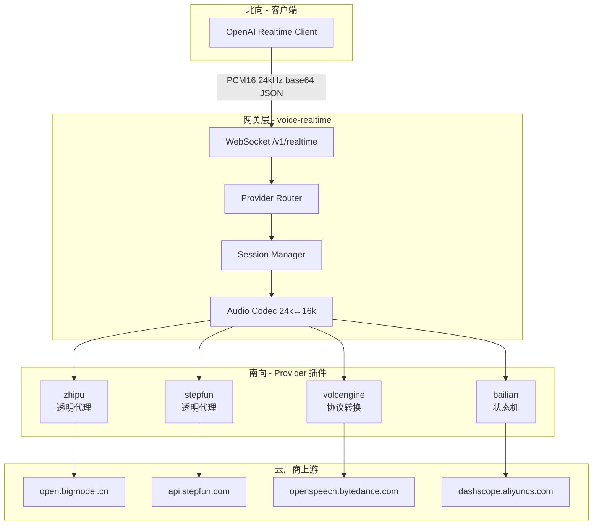
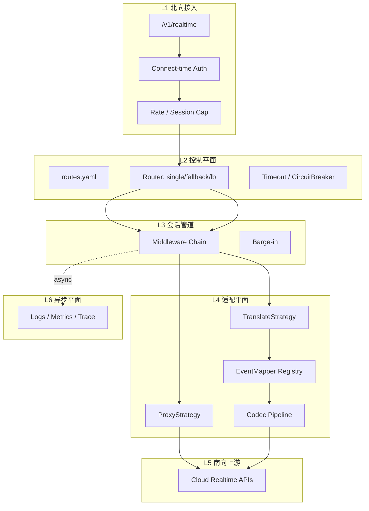
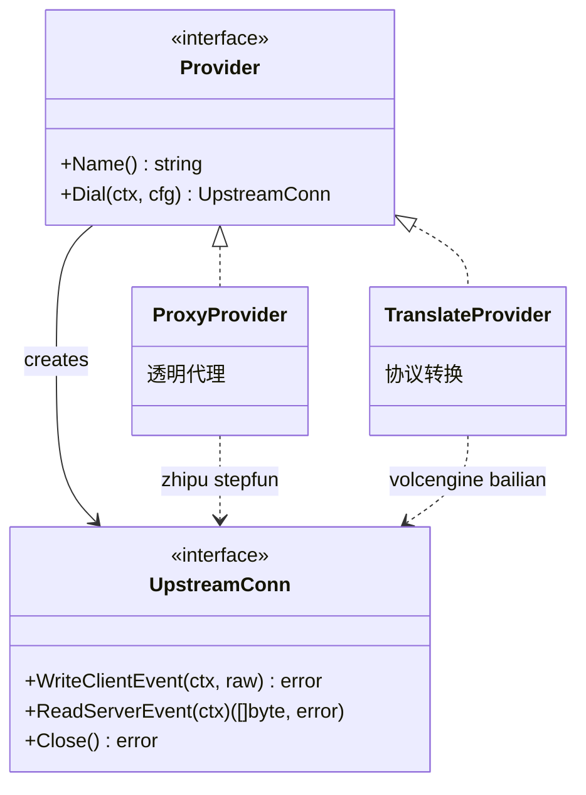
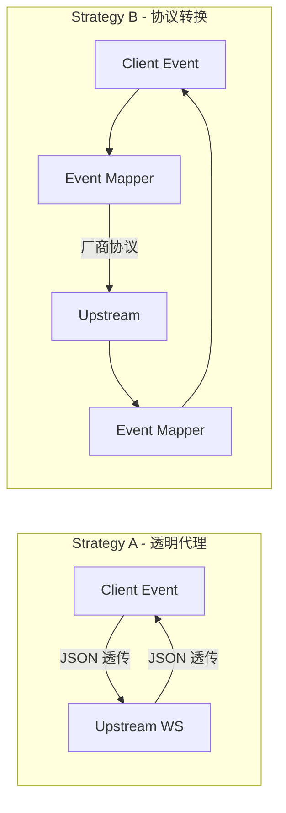
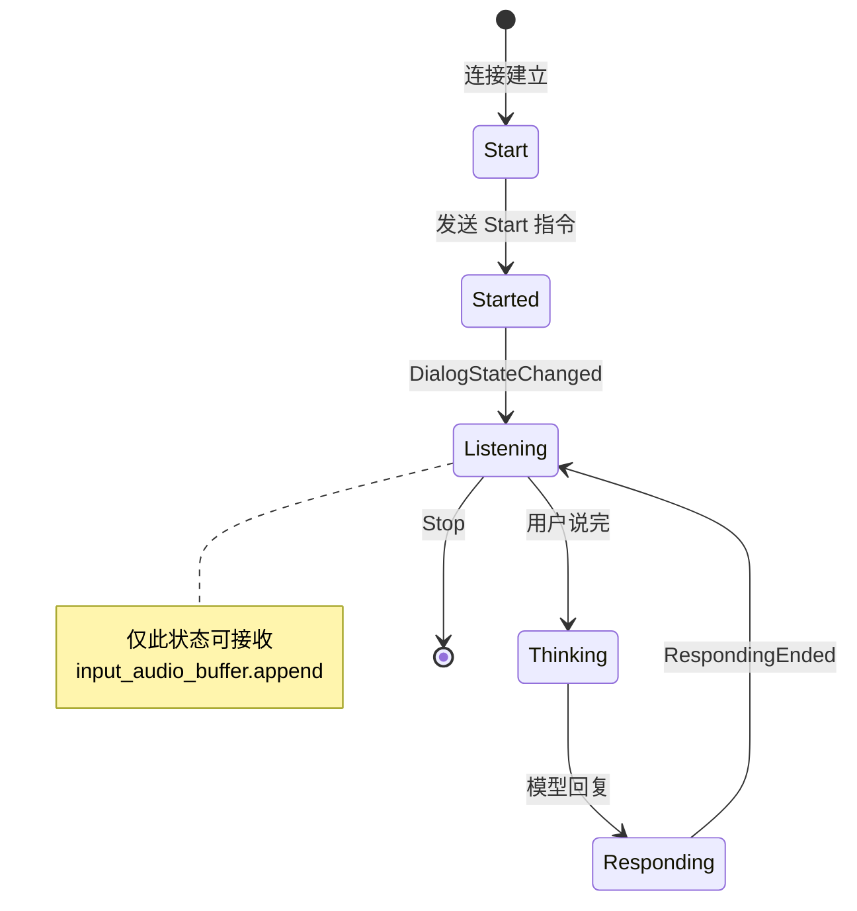
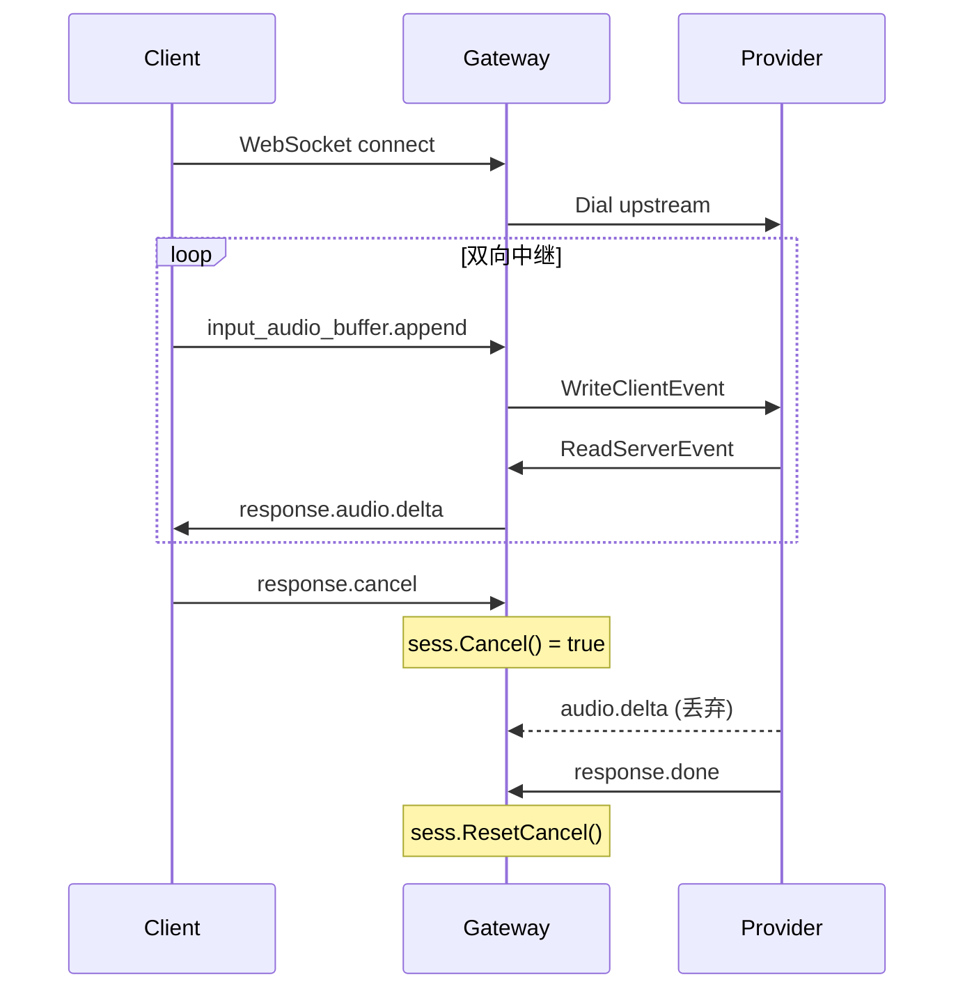

# 架构设计

> **voice-realtime** 是一个 **OpenAI Realtime API 兼容** 的 WebSocket 网关，用一套北向协议对接多家国内云厂商的**端到端语音大模型**（Speech-to-Speech），让客户端「改 URL 即可换云」。

---

## 1. 问题与定位

### 1.1 我们要解决什么

| 痛点 | 现状 | voice-realtime 的做法 |
|------|------|------------------------|
| 协议碎片化 | 火山二进制帧、百炼多模态状态机、智谱/阶跃类 OpenAI 协议 | **北向统一** OpenAI Realtime |
| 密钥暴露 | 客户端直连云厂商需携带 API Key | **密钥仅在服务端**，网关代签 |
| 切换成本高 | 换云 = 重写客户端 | `?provider=zhipu` 改查询参数即可 |
| 可观测性弱 | 各 SDK 日志格式不一 | 网关统一 session / 延迟 / 错误 |

### 1.2 不做什么

- **不做** ASR / LLM / TTS 级联编排（那是 Vui、Pipecat、LiveKit Agents 的职责）
- **不做** 模型推理（推理留在各云厂商侧）
- **不做** WebRTC 媒体平面（一期仅 WebSocket；后续可扩展）

### 1.3 与生态的关系

```text
┌─────────────┐     OpenAI Realtime      ┌──────────────────┐
│ Vui /       │ ───────────────────────► │ voice-realtime   │
│ OpenClaw /  │     ws://host/v1/realtime │ (本仓库)         │
│ 自研客户端   │                          └────────┬─────────┘
└─────────────┘                                   │
                    ┌──────────────┬──────────────┼──────────────┐
                    ▼              ▼              ▼              ▼
                 智谱 GLM      阶跃 StepFun    火山豆包       阿里云百炼
```

---

## 2. 现状架构（MVP，已实现）

> 下图描述**当前代码**的数据流。Router / Codec 在实现上尚未独立为包，详见 [§4 现状 vs 目标](#4-现状-vs-目标对照)。



---

## 3. 目标态五层架构

借鉴 [LiteLLM](https://github.com/BerriAI/litellm)、[Portkey](https://github.com/Portkey-AI/gateway)、[Bifrost](https://github.com/maximhq/bifrost)、[Helicone](https://github.com/Helicone/helicone) 的网关实践，目标演进到 **控制平面与数据平面分离** 的五层模型：



| 层级 | 职责 | 业界参考 | RFC |
|------|------|----------|-----|
| L1 北向接入 | WS 升级、鉴权、限流 | ai-portfolio-voice-service | [RFC 001](rfc/001-middleware-and-routes.md) |
| L2 控制平面 | 配置驱动路由、fallback | Portkey、LiteLLM | [RFC 001](rfc/001-middleware-and-routes.md) |
| L3 会话管道 | Middleware 链、barge-in | Bifrost | [RFC 001](rfc/001-middleware-and-routes.md) |
| L4 适配平面 | Provider + 双策略 + 映射表 | LiteLLM transformations | — |
| L5 南向上游 | 云厂商 WS | — | — |
| L6 异步平面 | 观测不挡热路径 | Helicone | [RFC 002](rfc/002-realtime-hotpath-tiers.md) |

**北向 URL 演进：**

```text
# 当前（MVP）
ws://host/v1/realtime?provider=zhipu&model=glm-realtime-flash

# 目标（配置驱动）
ws://host/v1/realtime?route=voice-default
```

---

## 4. 现状 vs 目标对照

| 维度 | 现状（MVP） | 目标态 | 借鉴 | Phase |
|------|-------------|--------|------|-------|
| 路由 | URL `?provider=` | `routes.yaml` + fallback | Portkey | P1a |
| 横切能力 | handler 内联 | Middleware 链 | Bifrost | P1a |
| Provider 插件 | `Provider` 接口 + registry | 保留，外加 Strategy 分层 | LiveKit Agents | P1 |
| 协议映射 | 手写 `translate()` | 表驱动 EventMapper | LiteLLM | P2/P3 |
| Proxy 热路径 | 基本透传 | Tier-0 零 JSON 解析 | openai-realtime-proxy | P1 |
| Translate 热路径 | 每帧分配 + 线性重采样 | Tier-1 Pool + 快速重采样 | — | P4a |
| 观测 | 同步 slog | Tier-2 异步 metrics | Helicone | P4b |
| 北向鉴权 | 无 | Virtual Key / JWT | LiteLLM | P4 |
| 熔断降级 | 无 | Dial 阶段 fallback + CB | Portkey | P4 |
| 契约测试 | 少量 unit | mock upstream 回放 | LiveKit Agents | P1b |
| 压测门禁 | 文档目标 only | benchmark CI | LiteLLM | P4 |

---

## 5. 核心架构机制

### 5.1 机制一：北向协议统一（Northbound Unification）

**原则**：客户端只讲一种语言 —— [OpenAI Realtime API](https://platform.openai.com/docs/guides/realtime)。

| 能力 | 北向事件 | 音频格式 |
|------|----------|----------|
| 会话配置 | `session.update` | — |
| 上行音频 | `input_audio_buffer.append` | PCM16 LE, 24 kHz, mono, base64 |
| 打断 | `response.cancel` | — |
| 下行音频 | `response.audio.delta` | 同上 |
| 转写 | `conversation.item.input_audio_transcription.*` | — |

参考实现规范：[Vui realtime-api](https://github.com/lixuanqun/vui/blob/main/docs/realtime-api.md)（本 monorepo 内 `speech-llm/vui/docs/realtime-api.md`）。

**连接 URL**：

```text
ws://{host}/v1/realtime?provider={name}&model={model_id}
```

---

### 5.2 机制二：Provider 插件（南向可扩展）

所有云厂商通过同一套接口接入，注册表模式参考 [asr-eval backends](https://github.com/lixuanqun/asr-eval)。



```go
// 核心抽象 — internal/providers/provider.go
type Provider interface {
    Name() string
    Dial(ctx context.Context, cfg ConnectConfig) (UpstreamConn, error)
}

type UpstreamConn interface {
    WriteClientEvent(ctx context.Context, raw []byte) error
    ReadServerEvent(ctx context.Context) ([]byte, error)
    Close() error
}
```

**扩展新厂商只需 4 步**（详见 [CONTRIBUTING.md](../CONTRIBUTING.md)）：

1. `internal/providers/<name>/` 实现接口
2. `init()` 中 `providers.Register`
3. `config` 增加鉴权字段
4. `docs/providers/<name>.md` 写协议映射表

---

### 5.3 机制三：双适配策略（Proxy vs Translate）



| 策略 | 适用厂商 | 复杂度 | 延迟 |
|------|----------|--------|------|
| **Proxy** | 智谱、阶跃星辰（原生 OpenAI Realtime 风格） | 低 | 最低 |
| **Translate** | 火山（二进制 gzip 帧）、百炼（多模态状态机） | 高 | 略增（编解码 + 映射） |

#### 火山豆包：二进制帧协议

```text
Client append (base64 PCM 24k)
    → 重采样 16k
    → gzip + 二进制帧 (event 200)
    ← gzip 解压 TTS PCM 16k
    → 重采样 24k
    → response.audio.delta (base64)
```

#### 百炼：多模态状态机



| 百炼事件 | OpenAI Realtime 事件 |
|----------|---------------------|
| `SpeechStarted` | `input_audio_buffer.speech_started` |
| `SpeechEnded` | `speech_stopped` + `committed` |
| `RespondingStarted` | `response.created` |
| 二进制 PCM | `response.audio.delta` |
| `RespondingEnded` | `response.audio.done` + `response.done` |

---

### 5.4 机制四：会话与打断（Session & Barge-in）



- 每个 WebSocket 连接 = 一个 `session.State`
- `response.cancel` 触发 barge-in：丢弃进行中的 `response.audio.delta`，直到 `response.done`
- 南向打断语义因厂商而异（百炼 → `RequestToSpeak`，火山 → 客户端侧丢弃）

---

### 5.5 机制五：音频管线（Audio Pipeline）

```text
         北向 (OpenAI)              南向 (火山/百炼)
    ┌─────────────────┐         ┌─────────────────┐
    │ PCM16 24kHz     │ ──down──►│ PCM16 16kHz     │
    │ mono LE base64  │         │ raw binary      │
    └─────────────────┘         └─────────────────┘
    ┌─────────────────┐         ┌─────────────────┐
    │ PCM16 24kHz     │ ◄──up───│ PCM16 16kHz     │
    │ (客户端播放)     │         │ (TTS 输出)       │
    └─────────────────┘         └─────────────────┘
```

实现：`internal/realtime/codec.go` 线性插值重采样（MVP）；后续可换 libsamplerate / soxr。

---

### 5.6 机制六：安全与配置

```text
┌──────────────┐      无云厂商 Key       ┌──────────────┐
│   Client     │ ─────────────────────► │   Gateway    │
└──────────────┘                        │  (env 密钥)   │
                                        └──────┬───────┘
                                               │ Bearer / X-Api-*
                                               ▼
                                        ┌──────────────┐
                                        │  Cloud API   │
                                        └──────────────┘
```

| 环境变量 | 厂商 |
|----------|------|
| `ZHIPU_API_KEY` | 智谱 |
| `STEPFUN_API_KEY` | 阶跃星辰 |
| `VOLCENGINE_APP_ID` + `VOLCENGINE_ACCESS_KEY` | 火山 |
| `DASHSCOPE_API_KEY` + `BAILIAN_WORKSPACE_ID` + `BAILIAN_APP_ID` | 百炼 |

> **生产必读**：网关本身尚无北向鉴权（`TODO`），公网部署需前置 API Gateway / mTLS。

---

## 6. 目录与职责

```text
cmd/voice-realtime/          # 进程入口、Provider 注册
internal/
  gateway/                   # WS 接入、路由、双 goroutine 中继
  realtime/                  # 北向事件常量、PCM 编解码
  session/                   # 会话状态、barge-in 标志
  providers/
    provider.go              # 接口定义
    registry.go              # 注册表
    proxy/                   # 透明代理公共逻辑
    zhipu/ stepfun/          # Strategy A
    volcengine/ bailian/     # Strategy B
docs/
  ARCHITECTURE.md            # 本文件
  ROADMAP.md                 # 开发路线
  providers/*.md             # 各厂商协议映射
```

---

## 7. 非功能目标（Phase 4+）

| 维度 | 目标 | 状态 |
|------|------|------|
| 首包延迟 | 网关转发开销 < 5 ms P99 | 待基准测试 |
| 并发 | 1k+ WS 连接 / 单实例 | 待压测 |
| 可观测 | trace_id、分段延迟 metrics | 待实现 |
| 北向鉴权 | API Key / JWT | 待实现 |
| 熔断降级 | 上游超时自动 error 事件 | 待实现 |

---

## 8. 相关阅读

- [RFC 索引](rfc/README.md) — 架构决策记录
- [RFC 001 Middleware + routes.yaml](rfc/001-middleware-and-routes.md)
- [RFC 002 热路径 Tier 分级](rfc/002-realtime-hotpath-tiers.md)
- [开发路线 ROADMAP.md](ROADMAP.md)
- [参与贡献 CONTRIBUTING.md](../CONTRIBUTING.md)
- [厂商接入 docs/providers/](providers/)
- [AI 语音工程化全景](https://github.com/lixuanqun/voice_repo/blob/main/docs/wechat-series/ai-voice-engineering/00-overview.md)（monorepo 内）
