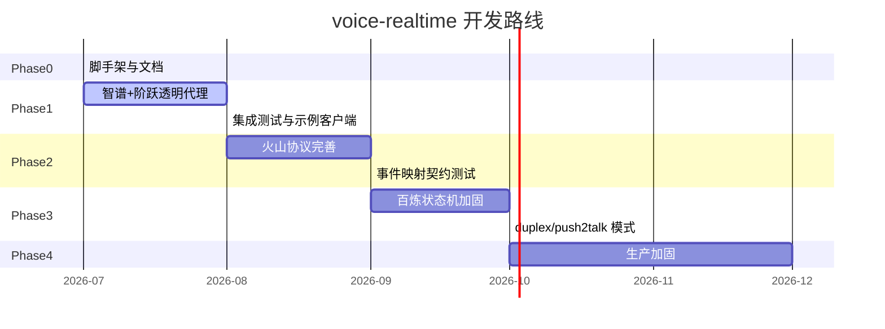

# 开发路线

> 本路线按 **可交付、可验证** 拆分阶段。每个 Phase 结束时应能独立 demo，并吸引对应类型的贡献者加入。

**图例**：✅ 已完成骨架 · 🚧 进行中 · 📋 计划中

---

## 全景时间线



---

## Phase 0 — 脚手架与社区基建 ✅

**目标**：仓库可 clone、可 build、文档可读、Issue 可提。

| 交付物 | 状态 | 验收标准 |
|--------|------|----------|
| Go module + CI | ✅ | `go test ./...` 绿 |
| Gateway 空路由 | ✅ | `/healthz` 200 |
| ARCHITECTURE.md | ✅ | 含架构图与核心机制 |
| ROADMAP.md | ✅ | 本文件 |
| CONTRIBUTING.md | ✅ | 贡献流程清晰 |
| README 中英摘要 | ✅ | 30 秒看懂项目 |
| GitHub Labels | ✅ | 见 [LABELS.md](../.github/LABELS.md) |

**欢迎贡献**：文档翻译、README 改进、示例客户端（Python/JS）。

---

## Phase 1 — 透明代理（智谱 + 阶跃）🚧

**目标**：OpenAI Realtime 客户端 **只改 URL** 即可对话。

| 任务 | 状态 | Label |
|------|------|-------|
| zhipu 透明代理 + 鉴权注入 | ✅ 骨架 | `provider/zhipu` |
| stepfun 透明代理 + model 参数 | ✅ 骨架 | `provider/stepfun` |
| 真实 Key 联调验证 | 📋 | `help wanted` |
| Python 最小 demo 客户端 | 📋 | `good first issue` |
| `session.update` 字段映射（voice/instructions） | 📋 | `area/protocol` |
| 契约测试（录制/回放 mock WS） | 📋 | `area/ci` |

**验收标准**：

```bash
# 智谱
ws://localhost:8080/v1/realtime?provider=zhipu&model=glm-realtime-flash

# 阶跃
ws://localhost:8080/v1/realtime?provider=stepfun&model=stepaudio-2.5-realtime
```

用现有 OpenAI Realtime SDK / Vui 客户端连接，完成一轮语音问答。

---

## Phase 2 — 火山豆包协议转换 📋

**目标**：火山二进制 gzip 帧 ↔ OpenAI Realtime 稳定映射。

| 任务 | 状态 | Label |
|------|------|-------|
| 二进制协议编解码 | ✅ 骨架 | `provider/volcengine` |
| StartConnection / StartSession 握手 | ✅ 骨架 | `provider/volcengine` |
| 音频帧 event 200 上行 | ✅ 骨架 | `provider/volcengine` |
| TTS 下行 → response.audio.delta | 🚧 | `provider/volcengine` |
| ASR 文本 → transcription 事件 | 📋 | `provider/volcengine` |
| 真实账号联调 | 📋 | `help wanted` |
| 协议版本锁定 + 契约测试 | 📋 | `area/protocol` |

**参考**：[RealtimeDialog-doubao](https://github.com/SUAT-AIRI/RealtimeDialog-doubao)

**风险**：火山协议可能随版本更新 → 用 `docs/providers/volcengine.md` 记录版本号。

---

## Phase 3 — 百炼多模态状态机 📋

**目标**：`DialogStateChanged(Listening)` 时序正确，双工对话可用。

| 任务 | 状态 | Label |
|------|------|-------|
| Start → Started → Listening 等待 | ✅ 骨架 | `provider/bailian` |
| 二进制音频上行/下行 | ✅ 骨架 | `provider/bailian` |
| RespondingContent 文本映射 | ✅ 骨架 | `provider/bailian` |
| response.cancel → RequestToSpeak | ✅ 骨架 | `provider/bailian` |
| duplex / tap2talk / push2talk 模式 | 📋 | `provider/bailian` |
| LocalRespondingEnded 回传 | 📋 | `provider/bailian` |
| 真实 workspace + app 联调 | 📋 | `help wanted` |
| 状态机单测覆盖 | 📋 | `good first issue` |

**参考**：[百炼多模态交互协议](https://help.aliyun.com/zh/model-studio/multimodal-interaction-protocol)

---

## Phase 4 — 生产加固 📋

**目标**：可上线、可观测、可运维。

| 任务 | 状态 | Label |
|------|------|-------|
| 北向鉴权（API Key / JWT） | 📋 | `area/gateway` |
| Prometheus metrics（延迟分段） | 📋 | `area/observability` |
| 优雅关闭 + 连接 draining | 📋 | `area/gateway` |
| 上游超时 / 熔断 / 重试 | 📋 | `area/gateway` |
| 限流（per-IP / per-key） | 📋 | `area/gateway` |
| 高质量重采样（soxr） | 📋 | `enhancement` |
| Docker / Helm chart | 📋 | `good first issue` |
| 对接 asr-eval 延迟指标 | 📋 | `enhancement` |

**SLA 参考**（来自 monorepo AI 语音工程化系列）：

| 指标 | 目标 |
|------|------|
| 网关转发开销 P99 | < 5 ms |
| 首字延迟（端到端） | 依赖上游，网关不劣化 > 50 ms |

---

## Phase 5 — 生态扩展（远期）

| 方向 | 说明 |
|------|------|
| 新厂商 | MiniMax、腾讯、百度、OpenAI/Azure 直连 |
| WebRTC 接入 | 参考 LiveKit 模式 |
| 级联模式 | 可选 ASR+LLM+TTS 路由（与 Pipecat 互补） |
| 多租户 | 按租户隔离密钥与配额 |

---

## 如何参与

1. 浏览 [Good First Issues](https://github.com/lixuanqun/voice-realtime/issues?q=is%3Aissue+is%3Aopen+label%3A%22good+first+issue%22)
2. 阅读 [CONTRIBUTING.md](../CONTRIBUTING.md)
3. 在 Issue 中认领任务（评论 `/assign` 或留言）
4. 提交 PR，关联 Issue 编号

### 我们特别需要的帮助

| 你能做什么 | 对应 Phase |
|------------|------------|
| 有火山/百炼账号，帮忙联调 | P2, P3 |
| 写 Python/JS 示例客户端 | P1 |
| 补充协议映射文档 | P2, P3 |
| 性能压测与 profiling | P4 |
| 英文文档翻译 | P0+ |

---

## 里程碑与 Release

| 版本 | 目标 Phase | 标志性能力 |
|------|------------|------------|
| **v0.1.0** | P0 + P1 骨架 | 仓库可用、智谱/阶跃可连 |
| **v0.2.0** | P1 完成 | 示例客户端、契约测试 |
| **v0.3.0** | P2 完成 | 火山豆包稳定对话 |
| **v0.4.0** | P3 完成 | 百炼双工对话 |
| **v1.0.0** | P4 核心 | 鉴权 + metrics + 生产就绪 |
