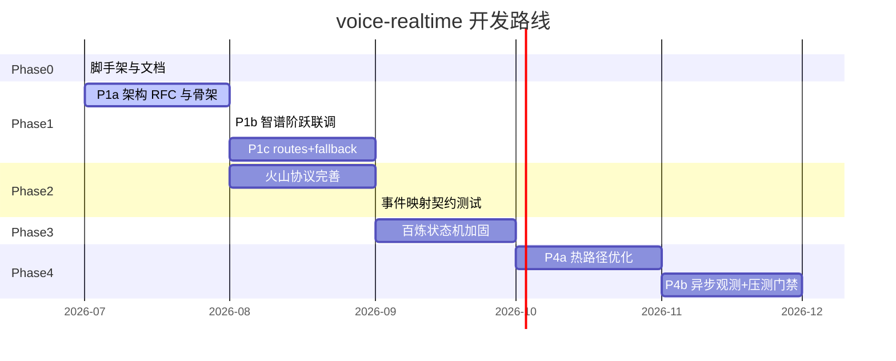

# 开发路线

> 本路线按 **可交付、可验证** 拆分阶段。每个 Phase 结束时应能独立 demo，并吸引对应类型的贡献者加入。

**图例**：✅ 已完成 · 🚧 进行中 · 📋 计划中

**架构 RFC**：[docs/rfc/](rfc/README.md) — 重大设计先评审再编码。

---

## 全景时间线



---

## Phase 0 — 脚手架与社区基建 ✅

| 交付物 | 状态 |
|--------|------|
| Go module + CI | ✅ |
| Gateway 骨架 | ✅ |
| ARCHITECTURE.md（含目标态五层 + 现状对照） | ✅ |
| ROADMAP.md | ✅ |
| CONTRIBUTING.md、Labels、Issue 模板 | ✅ |
| RFC 001 / RFC 002 草案 | ✅ |

---

## Phase 1 — 透明代理与架构加固

拆分为三个子阶段，**先架构、后联调、再路由**。

### P1a — 架构 RFC 与 Middleware 骨架 🚧

**目标**：确立可扩展网关形态，不破坏现有 `?provider=` 用法。

| 任务 | 状态 | RFC / Issue |
|------|------|-------------|
| [RFC 001](rfc/001-middleware-and-routes.md) Middleware + routes.yaml | 🚧 草案 | #6 |
| [RFC 002](rfc/002-realtime-hotpath-tiers.md) 热路径 Tier 分级 | 🚧 草案 | #7 |
| `configs/routes.example.yaml` | ✅ | — |
| `internal/middleware/` Chain 骨架 | 📋 | #6 |
| Barge-in 从 handler 迁入 Middleware | 📋 | #6 |
| Proxy 路径 Tier-0 审计（零多余 JSON 解析） | 📋 | #7 |

**验收**：`go test ./...` 通过；Middleware Chain 单测；行为与 MVP 兼容。

### P1b — 智谱 + 阶跃联调与契约测试 📋

**目标**：OpenAI Realtime 客户端只改 URL 即可对话。

| 任务 | 状态 | Issue |
|------|------|-------|
| zhipu / stepfun 透明代理骨架 | ✅ | — |
| 真实 Key 联调 | 📋 | #2 |
| Python 最小 demo 客户端 | 📋 | #1 |
| mock upstream 契约测试 | 📋 | #4 |
| `session.update` 字段映射 | 📋 | — |

```bash
ws://localhost:8080/v1/realtime?provider=zhipu&model=glm-realtime-flash
ws://localhost:8080/v1/realtime?provider=stepfun&model=stepaudio-2.5-realtime
```

### P1c — routes.yaml 与 Dial 阶段 Fallback 📋

**目标**：配置驱动路由，上游不可达自动切换。

| 任务 | 状态 |
|------|------|
| 加载 `routes.yaml` | 📋 |
| `?route=voice-default` 北向 URL | 📋 |
| Dial 阶段 fallback（stepfun → zhipu） | 📋 |
| `?provider=` 向后兼容 | 📋 |

**验收**：

```bash
ws://localhost:8080/v1/realtime?route=voice-default
# stepfun 不可达时自动 fallback 到 zhipu（mock 测试）
```

---

## Phase 2 — 火山豆包协议转换 📋

| 任务 | 状态 |
|------|------|
| 二进制编解码骨架 | ✅ |
| 表驱动 EventMapper | 📋 |
| gzip Writer 连接级复用（RFC 002 Tier-1） | 📋 |
| 真实账号联调 | 📋 #3 |
| 契约测试 + 协议版本文档 | 📋 |

---

## Phase 3 — 百炼多模态状态机 📋

| 任务 | 状态 |
|------|------|
| Start → Listening 状态机骨架 | ✅ |
| 状态机单测 | 📋 #4 |
| duplex / push2talk | 📋 |
| 真实 workspace 联调 | 📋 |

---

## Phase 4 — 生产加固

### P4a — 热路径优化（RFC 002）📋

| 任务 | 状态 |
|------|------|
| `sync.Pool` 音频缓冲 | 📋 |
| 24k→16k 快速重采样路径 | 📋 |
| 可选 soxr 高质量模式 | 📋 |
| Tier-0 benchmark 基线 | 📋 |

### P4b — 治理与观测 📋

| 任务 | 状态 |
|------|------|
| Virtual Key 北向鉴权 | 📋 #5 |
| Prometheus 分段 metrics（异步） | 📋 |
| 熔断 / 会话超时 / 背压 | 📋 |
| k6 WS 压测 + CI 门禁 | 📋 |
| Docker / Helm | 📋 |

**SLA 门禁**：

| 指标 | 目标 |
|------|------|
| Tier-0 转发 P99 | < 2 ms |
| Tier-1 转发 P99 | < 8 ms |
| 1k 并发 WS（mock upstream） | 无 OOM、无 goroutine 泄漏 |

---

## Phase 5 — 生态扩展（远期）

新厂商、WebRTC、级联模式、多租户 — 见 [ARCHITECTURE.md](ARCHITECTURE.md) §4。

---

## 里程碑与 Release

| 版本 | Phase | 能力 |
|------|-------|------|
| **v0.1.0** | P0 + P1 骨架 | 仓库可用 |
| **v0.2.0** | P1a + P1b | Middleware 骨架 + 联调通过 |
| **v0.3.0** | P1c + P2 | routes.yaml + 火山稳定 |
| **v0.4.0** | P3 | 百炼双工 |
| **v1.0.0** | P4 | 热路径 + 观测 + 压测门禁 |

---

## 如何参与

- [Good First Issues](https://github.com/lixuanqun/voice-realtime/issues?q=is%3Aopen+label%3A%22good+first+issue%22)
- [RFC 讨论](https://github.com/lixuanqun/voice-realtime/issues?q=is%3Aopen+label%3Atype%2Frfc)
- [CONTRIBUTING.md](../CONTRIBUTING.md)
