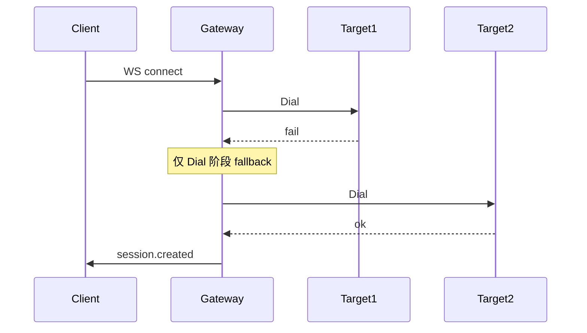

# RFC 001：Middleware 链与 routes.yaml 配置驱动路由

| 属性 | 值 |
|------|-----|
| 状态 | 草案 Draft |
| 作者 | voice-realtime maintainers |
| 关联 Issue | [#6](https://github.com/lixuanqun/voice-realtime/issues/6) |
| 目标 Phase | P1a |

## 摘要

引入 **Middleware Pipeline** 与 **routes.yaml 控制平面**，将横切能力（鉴权、限流、路由、观测）从 `gateway/handler` 中剥离，借鉴 [Bifrost](https://docs.getbifrost.ai/architecture/core/plugins) 的 Hook 模型与 [Portkey](https://portkey-ai-gateway.mintlify.app/concepts/configs) 的 Config 驱动路由。

## 动机

### 现状问题

1. `handleRealtime` 内联了路由、会话、barge-in、中继逻辑，扩展新能力需改核心 handler
2. 路由仅靠 `?provider=` 查询参数，无法 fallback、权重、按租户选路
3. 北向鉴权、限流、metrics 无统一挂载点

### 业界参考

| 项目 | 借鉴点 |
|------|--------|
| Bifrost | `PreRequest → PreLLM → PostLLM` 管道；placement/order |
| Portkey | `strategy.mode`: single / fallback / loadbalance / conditional |
| LiteLLM | `config.yaml` model_list；虚拟 API Key |

## 设计

### 1. Middleware 接口

```go
// internal/middleware/middleware.go

type Context struct {
    SessionID   string
    RouteName   string
    Provider    string
    Model       string
    TraceID     string
    Metadata    map[string]string
}

type Middleware interface {
    Name() string
    OnConnect(ctx context.Context, c *Context) error
    OnClientEvent(ctx context.Context, c *Context, raw []byte) ([]byte, error)
    OnUpstreamEvent(ctx context.Context, c *Context, raw []byte) ([]byte, error)
    OnClose(ctx context.Context, c *Context)
}

type Chain struct {
    middlewares []Middleware
}
```

**执行顺序（内置，按 order）：**

| Order | Middleware | 职责 |
|-------|------------|------|
| 10 | `AuthMiddleware` | Virtual Key / JWT，connect 时校验 |
| 20 | `RateLimitMiddleware` | 每 IP / 每 Key 连接数、QPS |
| 30 | `TraceMiddleware` | 注入 `trace_id`，写 session 上下文 |
| 40 | `BargeInMiddleware` | `response.cancel` 状态（从 handler 迁入） |
| 50 | `MetricsMiddleware` | 热路径仅计数，异步 flush |
| 100 | `DialMiddleware` | 调用 Router 选路并 `Provider.Dial` |

**原则：**

- `OnClientEvent` / `OnUpstreamEvent` 对 **音频 delta 帧** 默认透传，不做 JSON 全量解析
- Middleware 返回 error → 向客户端写 `error` 事件并关闭连接
- 插件错误不 panic 核心（借鉴 Bifrost failure isolation）

### 2. routes.yaml Schema

```yaml
# configs/routes.yaml

routes:
  - name: voice-default          # ws://host/v1/realtime?route=voice-default
    strategy:
      mode: fallback             # single | fallback | loadbalance
      on_errors:                 # Realtime 仅在 Dial 阶段 fallback
        - dial_timeout
        - dial_refused
        - http_429
        - http_502
    targets:
      - provider: stepfun
        model: stepaudio-2.5-realtime
        weight: 70               # loadbalance 时使用
      - provider: zhipu
        model: glm-realtime-flash
        weight: 30
    timeout_ms: 30000
    max_sessions_per_key: 100

  - name: voice-cn-volc
    strategy:
      mode: single
    targets:
      - provider: volcengine
```

**北向 URL 优先级：**

```text
1. ?route=voice-default     # 生产推荐
2. ?provider=zhipu&model=  # 调试 / 向后兼容
```

### 3. Router 接口

```go
// internal/router/router.go

type Target struct {
    Provider string
    Model    string
    Weight   int
}

type Route struct {
    Name     string
    Strategy StrategyConfig
    Targets  []Target
}

type Router interface {
    Resolve(routeName string) (*Route, error)
    Dial(ctx context.Context, route *Route, cfg *config.Config) (providers.UpstreamConn, error)
}
```

**Fallback 语义（Realtime 特有）：**



已建立会话后 **不切换** upstream（与 HTTP 网关不同）。

### 4. 目录结构（目标态）

```text
internal/
  middleware/
    chain.go
    auth.go
    ratelimit.go
    trace.go
    bargein.go
    metrics.go
  router/
    router.go
    fallback.go
    loadbalance.go
  config/
    routes.go          # 加载 routes.yaml
  gateway/
    server.go          # 变薄：Accept → Chain.Run → relay
```

## 迁移计划

| 步骤 | 内容 | 破坏兼容 |
|------|------|----------|
| 1 | 引入 `Chain` 骨架，`BargeIn` 从 handler 迁入 | 否 |
| 2 | 加载 `routes.yaml`，`?route=` 与 `?provider=` 并存 | 否 |
| 3 | 实现 fallback Dial | 否 |
| 4 | Auth + RateLimit 中间件 | 否（默认关闭） |
| 5 | 废弃纯 `?provider=` 文档推荐 | 软废弃 |

## 开放问题

1. Virtual Key 存储：内存 / Redis / Postgres？（P4 前可内存）
2. `loadbalance` 是否按 session 粘滞到同一 target？
3. 是否支持嵌套 strategy（Portkey 风格）？建议 P4 再做

## 验收标准

- [ ] `configs/routes.example.yaml` 可加载
- [ ] `?route=voice-default` 在 stepfun 不可达时自动 fallback 到 zhipu（mock 测试）
- [ ] 新增中间件无需修改 `handleRealtime` 主体
- [ ] 单元测试覆盖 Chain 顺序与错误短路

## 参考

- [Bifrost Plugin Sequencing](https://docs.getbifrost.ai/plugins/sequencing)
- [Portkey Configs](https://portkey-ai-gateway.mintlify.app/concepts/configs)
- [Portkey Routing](https://portkey-ai-gateway.mintlify.app/concepts/routing)
- [LiteLLM ARCHITECTURE](https://github.com/BerriAI/litellm/blob/main/ARCHITECTURE.md)
