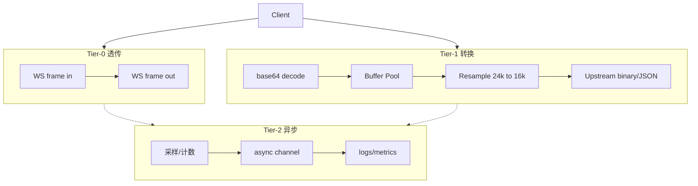

# RFC 002：Realtime 热路径 Tier-0/1/2 分级

| 属性 | 值 |
|------|-----|
| 状态 | 草案 Draft |
| 作者 | voice-realtime maintainers |
| 关联 Issue | [#7](https://github.com/lixuanqun/voice-realtime/issues/7) |
| 目标 Phase | P4a（设计 P1 起遵循） |

## 摘要

将 Realtime 数据平面分为 **Tier-0 透传 / Tier-1 转换 / Tier-2 异步观测** 三级，借鉴 [Helicone](https://github.com/Helicone/helicone) 的「热路径极简 + 异步日志」与 [openai-realtime-proxy](https://github.com/m1guelpf/openai-realtime-proxy) 的 verbatim relay。

## 动机

### 现状瓶颈

| 路径 | 每帧操作 | 问题 |
|------|----------|------|
| Proxy（智谱/阶跃） | WS 拷贝 + 偶发 JSON type 解析 | 可接受 |
| Translate（火山/百炼） | base64 + 重采样 + gzip + 新分配 | CPU/GC 压力大 |
| 观测 | 同步 slog | 可能挡热路径 |

### 延迟预算（网关自身）

| Tier | 场景 | P99 目标 |
|------|------|----------|
| Tier-0 | Proxy 透传 | < 2 ms |
| Tier-1 | Translate 含 codec | < 8 ms |
| 端到端 | 含云厂商 | 网关不劣化 > 50 ms |

## 设计

### 分级定义



### Tier-0：Proxy 黄金路径

**适用**：`zhipu`、`stepfun`

```go
// 规则
// 1. WriteClientEvent: 直接 ws.Write(text, raw)
// 2. ReadServerEvent: 直接 ws.Read → copy 一次返回
// 3. 仅对 type=response.cancel 做 EventType() 解析
// 4. 禁止 json.Unmarshal 完整事件
```

参考：[openai-realtime-proxy](https://github.com/m1guelpf/openai-realtime-proxy) — 升级时鉴权，之后 verbatim。

### Tier-1：Translate 受控转换

**适用**：`volcengine`、`bailian`

**优化项：**

| 优化 | 做法 | Phase |
|------|------|-------|
| Buffer Pool | `sync.Pool` 复用 `[]byte`，按 3200B（100ms@16k）分桶 | P4a |
| 快速重采样 | 24k→16k 固定比率 2/3，整数步进替代 float 插值 | P4a |
| 高质量重采样 | 可选 soxr（配置开关） | P4b |
| gzip 复用 | `gzip.Writer` / `Reader` 每连接一个实例 | P2 |
| 映射表 | 表驱动 event map，避免反射 | P2/P3 |

```go
// internal/realtime/pool.go
var pcmPool = sync.Pool{
    New: func() any {
        b := make([]byte, 0, 4800) // 100ms @ 24kHz stereo-safe mono
        return &b
    },
}
```

### Tier-2：异步观测

**原则**：热路径 **不** 写磁盘、**不** 打完整 JSON 日志。

| 数据 | 热路径 | 异步 |
|------|--------|------|
| 连接/断开 | 计数 +1 | 写结构化日志 |
| 每音频帧 | 字节计数 | 不记录 |
| 每 N 帧 | — | 采样延迟 histogram |
| session 结束 | — | 汇总 session 报告 |

参考 Helicone：Worker 代理 < 50ms，日志异步送 Jawn。

**指标（Prometheus）：**

```text
voice_gateway_connect_ms{route,provider}
voice_gateway_forward_ms{provider,tier}
voice_gateway_codec_ms{provider}
voice_gateway_sessions_active{route}
voice_gateway_frames_total{direction,tier}
```

Portkey Realtime 的 `RealtimeLlmEventParser` 可边转发边解析计费事件 — 我们 P4 可选实现类似 **非阻塞 parser**。

### 可选：二进制北向（P4+）

```text
?transport=binary
```

客户端发 WS Binary PCM16 24kHz，跳过 base64。与 OpenAI JSON 模式并存。

## 背压与限流

| 机制 | 说明 |
|------|------|
| 写超时 | `Write` 带 deadline，慢客户端断开 |
| 会话上限 | 每 Virtual Key max_sessions |
| 上游慢 | 不无限缓冲；超阈值 drop 并 `error` 事件 |

## 基准测试门禁（CI）

借鉴 [LiteLLM benchmarks](https://docs.litellm.ai/docs/benchmarks)：

```bash
# 目标（mock upstream）
go test ./internal/bench/... -bench=Tier0Proxy -benchtime=10s
# 验收：Tier-0 P99 forward < 2ms @ 1000 concurrent sessions（mock）
```

k6 WebSocket 脚本放 `bench/k6/realtime.js`（P4）。

## 迁移计划

| 步骤 | 内容 | 影响 |
|------|------|------|
| 1 | 文档 + 代码注释标注 Tier | 无 |
| 2 | Proxy 路径审计，移除多余 JSON 解析 | 行为不变 |
| 3 | volcengine gzip Writer 复用 | P2 |
| 4 | pcmPool + 快速重采样 | P4a |
| 5 | 异步 metrics + benchmark CI | P4b |

## 开放问题

1. 是否在 P1 就为 Proxy 路径加 benchmark 基线？
2. 二进制北向是否纳入 v1.0.0？
3. 采样率：网关统一 24k 北向，还是可配置？

## 验收标准

- [ ] Proxy / Translate 代码路径标注 `// tier:0` / `// tier:1`
- [ ] `sync.Pool` 用于 Translate 音频缓冲
- [ ] metrics 不在 `WriteClientEvent` 热路径打日志
- [ ] bench 测试 PR 门禁：Tier-0 回归不超过基线 10%

## 参考

- [Helicone Architecture](https://docs.helicone.ai/architecture)
- [Portkey Realtime](https://portkey-ai-gateway.mintlify.app/features/realtime)
- [openai-realtime-proxy](https://github.com/m1guelpf/openai-realtime-proxy)
- [ai-portfolio-voice-service](https://github.com/yubi00/ai-portfolio-voice-service) — session caps
